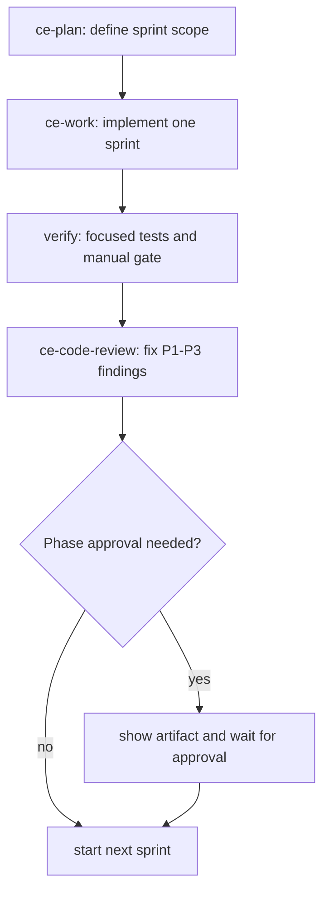

# feat: Sprint delivery loops for meeting app

## Summary

This plan turns the large product spec into small sprint loops that can be planned, implemented, reviewed, and approved without losing phase discipline. The next concrete step is to close Phase 1 with schema approval, git setup, and Xcode workspace scaffolding, then move into narrow capture and transcription spikes before higher-level features.

---

## Problem Frame

The app has a broad native client, Convex backend, LLM, audio, calendar, and second brain surface area. The main risk is trying to build too much before the high-risk capture and transcription assumptions are proven on real meetings.

---

## Requirements

- R1. Preserve the spec-driven gates in `SPEC.md`, including schema and prompt approval before dependent implementation.
- R2. Keep every sprint small enough to complete with a `ce-work` pass and a `ce-code-review` pass before starting the next sprint.
- R3. Prioritize high-risk technical proof before broad UI or second brain work.
- R4. Keep artifacts durable in repo files so `ce-plan`, `ce-work`, and `ce-code-review` can resume cleanly.
- R5. Run verification at every sprint boundary and record deviations in `DECISIONS.md`.

---

## Scope Boundaries

- Do not implement Phase 2 code until the Phase 1 schema and scaffold are approved.
- Do not start iOS, task UI, recipes, or Cognee work before Mac capture and transcription are proven.
- Do not optimize the full UI before core audio, transcript, and enhancement loops work.
- Do not store secrets in Convex document tables.

### Deferred to Follow-Up Work

- Cognee Mac Studio stack: Sprint 9 after the meeting workflow has useful enhanced notes.
- iOS companion: Sprint 7 after Mac meeting capture and Convex data contracts stabilize.
- Knowledge graph visualization: future optional polish.

---

## Context & Research

### Relevant Code and Patterns

- `SPEC.md` is the source of truth for product scope, phase gates, and stack choices.
- `convex/schema.ts` now contains the approved candidate data model with typed statuses, `calendarEvents`, secret references, task evidence, screenshot inline markers, and searchable meeting text.
- `DECISIONS.md` records path, OpenRouter secret, calendar secret, and audio sync decisions.
- `package.json` and `convex/tsconfig.json` provide the current backend verification gate.

### Institutional Learnings

- No `docs/solutions/` entries exist yet. Add one only after a repeated failure pattern appears.

### External References

- No external research is needed for this sprint plan. Local spec and current artifacts are sufficient.

---

## Key Technical Decisions

- Sprint size: one risky capability or one scaffold layer per sprint. This keeps `ce-code-review` findings small and actionable.
- Loop shape: each sprint starts with `ce-plan` only when scope changes, runs implementation with `ce-work`, then runs `ce-code-review` before approval.
- Capture-first sequencing: audio capture and transcription come before calendar, notes polish, tasks, iOS, and second brain because they decide whether the product can meet its core promise.
- Review gate: P1 findings block the next sprint. P2 findings are fixed before the next sprint unless explicitly logged in `DECISIONS.md`.

---

## Open Questions

### Resolved During Planning

- Next step after current schema fixes: close Phase 1, not Phase 2. The Xcode workspace and repo hygiene remain unfinished.
- Sprint model: use small review loops, not the original ten large phases as execution chunks.

### Deferred to Implementation

- Exact Xcode project generator choice: decide during Sprint 0 based on local tool availability and whether manual Xcode creation is faster.
- Exact Parakeet package integration shape: decide during Sprint 2 after inspecting FluidAudio Swift package APIs.
- Exact real meeting test logistics: coordinate when Sprint 1 reaches the real Zoom capture gate.

---

## High-Level Technical Design

> *This illustrates the intended approach and is directional guidance for review, not implementation specification. The implementing agent should treat it as context, not code to reproduce.*

---

## Sprint Roadmap

| Sprint | Goal | Main Gate | Recommended CE Loop |
|---|---|---|---|
| S0 | Close Phase 1 foundation | Schema approval and workspace scaffold | `ce-plan` if scope changes, `ce-work`, `ce-code-review` |
| S1 | Prove Mac audio capture | Real Zoom system plus mic file is clean | `ce-work`, `ce-code-review` |
| S2 | Prove Parakeet transcription | Real 30 minute meeting transcribes fast and accurately | `ce-work`, `ce-code-review` |
| S3 | Build live session shell | Live transcript UI and recording state work end to end | `ce-plan` for UI scope, `ce-work`, `ce-code-review` |
| S4 | Calendar and meeting detection | Coming up list and start-notes flow work | `ce-work`, `ce-code-review` |
| S5 | Notes and screenshots | Inline screenshot OCR survives note rendering | `ce-work`, `ce-code-review` |
| S6 | Enhancement and eval | Prompt approved, eval harness passes fixtures | `ce-plan` for prompt scope, `ce-work`, `ce-code-review` |
| S7 | Tasks and discovery | Extracted tasks link back to meeting evidence | `ce-work`, `ce-code-review` |
| S8 | iOS companion | Read meetings and capture voice memo tasks | `ce-plan` for iOS slice, `ce-work`, `ce-code-review` |
| S9 | Second brain host | Cognee ingest and query work over Tailscale | `ce-plan` for Mac Studio deployment, `ce-work`, `ce-code-review` |

---

## Implementation Units

- U1. **Sprint 0: close Phase 1 foundation**

**Goal:** Finish the foundation gate so Phase 2 can start from a clean repo, approved schema, and usable native workspace.

**Requirements:** R1, R2, R4, R5

**Dependencies:** None

**Files:**
- Modify: `SPEC.md`
- Modify: `DECISIONS.md`
- Modify: `README.md`
- Modify: `.gitignore`
- Modify: `package.json`
- Modify: `convex/schema.ts`
- Modify: `convex/tsconfig.json`
- Create: `apps/macOS/MeetingApp.xcodeproj`
- Create: `apps/iOS/MeetingAppMobile.xcodeproj`
- Create: `packages/Core/Package.swift`
- Test: `convex/tsconfig.json`

**Approach:**
- Initialize git before more work so future reviews have a real diff scope.
- Present `convex/schema.ts` for approval as the Phase 1 schema artifact.
- Scaffold the macOS app, iOS app, and shared Swift package without implementing capture logic.
- Update `README.md` with local setup and verification commands.

**Execution note:** Keep this as scaffold-first work. No Phase 2 audio implementation belongs here.

**Patterns to follow:**
- `SPEC.md` Phase 1 section.
- Current Convex schema and TypeScript check setup.

**Test scenarios:**
- Config: Convex schema validates with typechecking enabled.
- Config: Generated Convex types update without errors.
- Scaffold: Xcode opens the workspace and recognizes macOS, iOS, and Core package targets.
- Documentation: README setup lets a fresh local session run the backend check.

**Verification:**
- Phase 1 artifacts are present and reviewed.
- User approves the schema and scaffold before Phase 2 starts.

- U2. **Sprint 1: prove Mac audio capture**

**Goal:** Capture system audio and mic audio from a real video call into a clean local file.

**Requirements:** R2, R3, R5

**Dependencies:** U1

**Files:**
- Modify: `apps/macOS/MeetingApp/Services/AudioCaptureService.swift`
- Modify: `apps/macOS/MeetingApp/Services/PermissionsService.swift`
- Modify: `apps/macOS/MeetingApp/Views/RecordingControlsView.swift`
- Test: `apps/macOS/Tests/AudioCaptureServiceTests.swift`
- Test: `docs/manual-test-plan.md`

**Approach:**
- Build the narrowest macOS capture surface that requests permissions and records a local file.
- Add clear error states for missing screen recording, microphone, and system audio permissions.
- Defer Convex upload and transcript streaming until capture quality is proven.

**Execution note:** Characterization-first. Record a short local sample before adding more controls.

**Patterns to follow:**
- `SPEC.md` Phase 2 real Zoom gate.
- Apple ScreenCaptureKit and AVFoundation framework boundaries.

**Test scenarios:**
- Happy path: user starts capture during a Zoom call and receives a playable local mixed audio file.
- Error path: missing microphone permission reports a recoverable setup error.
- Error path: missing screen recording permission reports the exact permission needed.
- Edge case: stopping capture twice does not crash or corrupt the file.
- Manual gate: real Zoom call capture has audible system audio and mic audio.

**Verification:**
- A real Zoom capture file is clean enough for transcription.
- `ce-code-review` has no unresolved P1 findings.

- U3. **Sprint 2: prove Parakeet transcription**

**Goal:** Transcribe a real 30 minute meeting recording with Parakeet and measure speed plus quality.

**Requirements:** R2, R3, R5

**Dependencies:** U2

**Files:**
- Create: `packages/Core/Sources/Core/Services/TranscriptionProvider.swift`
- Create: `packages/Core/Sources/Core/Services/ParakeetProvider.swift`
- Create: `packages/Core/Sources/Core/Models/Transcript.swift`
- Create: `apps/macOS/MeetingApp/Services/TranscriptionRunner.swift`
- Test: `packages/Core/Tests/CoreTests/TranscriptionProviderTests.swift`
- Test: `docs/manual-test-plan.md`

**Approach:**
- Define provider protocol and transcript models in Core.
- Implement batch transcription first, then assess streaming after the provider works.
- Capture timing and rough WER notes for the real meeting gate.

**Execution note:** Treat FluidAudio API integration as execution-time discovery. Keep the Core protocol stable even if the provider wrapper changes.

**Patterns to follow:**
- `SPEC.md` TranscriptionProvider protocol.
- Current `convex/schema.ts` transcript segment fields.

**Test scenarios:**
- Happy path: batch transcribing a local audio file returns ordered transcript segments.
- Edge case: empty or unreadable audio file returns a typed failure.
- Integration: 30 minute recording finishes within the target performance envelope.
- Manual gate: transcript quality is acceptable for enhancement input.

**Verification:**
- Real meeting transcription works end to end.
- Speed and accuracy observations are written to `docs/manual-test-plan.md` or `DECISIONS.md`.

- U4. **Sprint 3: live meeting session shell**

**Goal:** Provide the first usable meeting session UI with recording state, live transcript updates, and notes autosave.

**Requirements:** R2, R3, R4, R5

**Dependencies:** U2, U3

**Files:**
- Create: `apps/macOS/MeetingApp/Views/MeetingSessionView.swift`
- Create: `apps/macOS/MeetingApp/ViewModels/MeetingSessionViewModel.swift`
- Modify: `packages/Core/Sources/Core/Models/Transcript.swift`
- Modify: `convex/meetings.ts`
- Modify: `convex/transcripts.ts`
- Test: `apps/macOS/Tests/MeetingSessionViewModelTests.swift`
- Test: `convex/tests/meetings.test.ts`

**Approach:**
- Build split notes and transcript UI with simple reactive state.
- Persist meetings and transcript segments through Convex mutations.
- Keep enhancement, screenshots, and calendar outside this sprint.

**Patterns to follow:**
- `SPEC.md` hybrid notes pattern.
- Current `meetings`, `transcriptSegments`, and `searchableText` schema.

**Test scenarios:**
- Happy path: starting a session creates a meeting record and shows recording state.
- Happy path: transcript segments append in order without blocking notes.
- Edge case: autosave failure shows nonblocking error state.
- Integration: another client would receive Convex-updated meeting data.

**Verification:**
- A recorded meeting can produce visible notes and transcript records.

- U5. **Sprint 4: calendar and meeting detection**

**Goal:** Populate Coming up from EventKit and Convex `calendarEvents`, then start notes from an event.

**Requirements:** R1, R2, R3, R5

**Dependencies:** U1, U4

**Files:**
- Create: `packages/Core/Sources/Core/Models/CalendarEvent.swift`
- Create: `apps/macOS/MeetingApp/Services/EventKitCalendarService.swift`
- Create: `apps/macOS/MeetingApp/Views/ComingUpView.swift`
- Modify: `convex/calendar.ts`
- Test: `apps/macOS/Tests/EventKitCalendarServiceTests.swift`
- Test: `convex/tests/calendar.test.ts`

**Approach:**
- Start with EventKit as the default source.
- Persist normalized event shape that matches `calendarEvents`.
- Add dedup logic as a tested utility before ICS or Google sync.

**Patterns to follow:**
- `calendarEvents` schema indexes.
- `SPEC.md` Calendar Integration rules.

**Test scenarios:**
- Happy path: future EventKit event appears in Coming up.
- Edge case: duplicate title and start time within five minutes dedups.
- Error path: denied Calendar permission shows a setup state.
- Integration: clicking Start notes links a meeting to the source event.

**Verification:**
- Coming up shows the next five events and can create a meeting note.

- U6. **Sprint 5: notes and screenshots**

**Goal:** Add inline screenshot capture with Vision OCR and durable note markers.

**Requirements:** R2, R3, R5

**Dependencies:** U4

**Files:**
- Create: `apps/macOS/MeetingApp/Services/ScreenshotCaptureService.swift`
- Create: `apps/macOS/MeetingApp/Services/OCRService.swift`
- Modify: `apps/macOS/MeetingApp/Views/MeetingSessionView.swift`
- Modify: `convex/screenshots.ts`
- Test: `apps/macOS/Tests/ScreenshotCaptureServiceTests.swift`
- Test: `convex/tests/screenshots.test.ts`

**Approach:**
- Use the updated default hotkey from `SPEC.md`.
- Insert `[[screenshot:<id>]]` markers into notes.
- Feed OCR text into the future enhancement context.

**Test scenarios:**
- Happy path: screenshot is captured, uploaded, and inserted at cursor as a marker.
- Happy path: OCR text is stored and linked to the meeting.
- Edge case: screenshot capture failure leaves notes unchanged.
- Integration: enhanced rendering can resolve screenshot markers.

**Verification:**
- Inline screenshot placement survives raw note save and reload.

- U7. **Sprint 6: enhancement prompt and eval harness**

**Goal:** Show and approve the enhancement prompt, then implement the OpenRouter enhancement action with fixture evals.

**Requirements:** R1, R2, R4, R5

**Dependencies:** U4, U6

**Files:**
- Create: `convex/prompts/enhanceMeeting.ts`
- Create: `convex/enhancement.ts`
- Create: `convex/tasks.ts`
- Create: `convex/tests/fixtures/ai_coe_synthetic.json`
- Create: `convex/tests/enhancement.test.ts`
- Modify: `SPEC.md`
- Modify: `DECISIONS.md`

**Approach:**
- Present prompt artifact for approval before implementing the action.
- Add fixture-based evals before using real meetings.
- Store extracted task evidence using `sourceTranscriptStartMs`, `sourceTranscriptEndMs`, and `sourceEvidence`.

**Execution note:** Test-first for eval criteria. The prompt should be adjusted against fixtures before generalizing.

**Test scenarios:**
- Happy path: AI CoE fixture extracts user and others tasks correctly.
- Style: output contains no em dashes and no semicolons.
- Error path: OpenRouter failure marks enhancement failed without losing notes.
- Integration: successful enhancement updates meeting, creates tasks, and schedules second brain ingestion placeholder.

**Verification:**
- Prompt is approved.
- Fixture evals pass.
- `ce-code-review` has no unresolved P1 or P2 findings.

---

## System-Wide Impact

- **Interaction graph:** Convex schema and generated types shape all client models. Capture and transcription should stay behind Core protocols.
- **Error propagation:** Permission, capture, transcription, OpenRouter, and Convex failures need visible recoverable states.
- **State lifecycle risks:** Meeting creation, recording start, transcript append, notes autosave, and enhancement must avoid partial state confusion.
- **API surface parity:** Core Swift models should track Convex schema changes as soon as client work begins.
- **Integration coverage:** Real meeting capture and real transcription gates are mandatory because mocks cannot prove audio capture quality.
- **Unchanged invariants:** The app remains single-user. No multi-tenant auth should be introduced in these sprints.

---

## Risks & Dependencies

| Risk | Mitigation |
|------|------------|
| Audio capture fails in real video apps | Sprint 1 isolates capture before other UI work |
| Parakeet integration is harder than expected | Sprint 2 keeps provider wrapper narrow and allows fallback decision logging |
| Schema changes ripple through native clients | Keep Phase 1 schema approval before app logic and update Core models immediately |
| Review loops become too large | One sprint equals one capability, with `ce-code-review` before proceeding |
| Convex free tier storage assumptions break | Keep audio local by default and opt in to cloud sync later |

---

## Documentation / Operational Notes

- Add a `docs/manual-test-plan.md` during Sprint 1 and keep it current through capture and transcription.
- Update `README.md` in Sprint 0 with setup, Convex validation, and Xcode workspace instructions.
- Keep `DECISIONS.md` current for any deviation from `SPEC.md`.

---

## Recommended Next Action

Start Sprint 0 now. The narrowest next `ce-work` unit is:

1. Initialize git for the repo root.
2. Show the updated `convex/schema.ts` for approval.
3. Scaffold the Xcode workspace, macOS app target, iOS app target, and Core Swift package.
4. Run `npm run convex:check`.
5. Run `ce-code-review` on the Phase 1 scaffold.
6. Ask for approval before Phase 2.

---

## Sources & References

- Origin document: `SPEC.md`
- Current schema: `convex/schema.ts`
- Decisions log: `DECISIONS.md`
- Backend check: `package.json`
