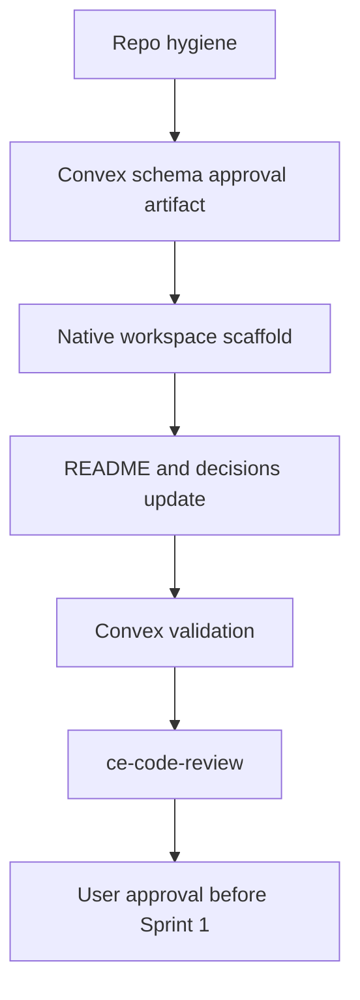

# feat: Close Sprint 0 foundation

## Summary

This plan closes the Phase 1 foundation gate. It prepares the repo for real review loops, gets the Convex schema ready for approval, scaffolds the native targets, and stops before any Phase 2 audio capture work begins.

---

## Problem Frame

The project has a validated Convex schema and a sprint roadmap, but it still lacks a git repo, native workspace scaffolding, and a clean approval handoff. Starting audio capture before those basics are stable would make later `ce-work` and `ce-code-review` loops noisy.

---

## Requirements

- R1. Initialize a reviewable repo state so future `ce-code-review` runs have a real diff scope.
- R2. Present the current Convex schema as the Phase 1 approval artifact.
- R3. Scaffold macOS, iOS, and Core package targets without adding capture, transcription, calendar, or enhancement behavior.
- R4. Document local setup and verification in `README.md`.
- R5. Preserve all deviations and technical decisions in `DECISIONS.md`.
- R6. Verify Convex schema and type generation before asking for approval.

---

## Scope Boundaries

- No ScreenCaptureKit or AVFoundation capture implementation.
- No FluidAudio, WhisperKit, or Deepgram integration.
- No calendar integration beyond existing schema shape.
- No LLM prompt or enhancement implementation.
- No iOS feature work beyond target scaffolding.
- No Cognee or Mac Studio implementation.

### Deferred to Follow-Up Work

- Audio capture proof moves to Sprint 1.
- Parakeet transcription proof moves to Sprint 2.
- Prompt approval and enhancement implementation move to Sprint 6.

---

## Context & Research

### Relevant Code and Patterns

- `SPEC.md` defines Phase 1 and requires schema approval before client code.
- `convex/schema.ts` is the current schema artifact.
- `package.json` exposes `convex:check` for backend validation.
- `convex/tsconfig.json` enables strict Convex TypeScript checking.
- `docs/plans/2026-05-03-001-feat-sprint-delivery-loops-plan.md` defines the broader sprint loop.

### Institutional Learnings

- No `docs/solutions/` entries exist yet.

### External References

- No external research is needed for Sprint 0. The work is scaffold and repo hygiene.

---

## Key Technical Decisions

- Use git before any more implementation so reviews operate on diffs rather than snapshots.
- Keep native scaffolding minimal. Targets should build or open, but should not contain product behavior beyond starter shells.
- Keep Convex as the only executable backend surface in Sprint 0.
- Treat schema approval as the Sprint 0 exit gate.

---

## Open Questions

### Resolved During Planning

- Sprint 0 should not implement capture. It should only prepare the foundation for Phase 2.
- The schema can remain in Convex local anonymous mode until the user links a cloud deployment.

### Deferred to Implementation

- Whether to create Xcode projects through Xcode, Swift Package Manager only, or a generator depends on local tool availability during `ce-work`.
- Exact app bundle identifiers can use placeholders unless the user provides signing details.
- Apple Developer signing setup can be deferred until real device or distribution testing.

---

## High-Level Technical Design

> *This illustrates the intended approach and is directional guidance for review, not implementation specification. The implementing agent should treat it as context, not code to reproduce.*

---

## Implementation Units

- U1. **Initialize repo hygiene**

**Goal:** Make the project reviewable and safe for future branch-based work.

**Requirements:** R1, R5

**Dependencies:** None

**Files:**
- Modify: `.gitignore`
- Modify: `DECISIONS.md`

**Approach:**
- Initialize git if no `.git` directory exists.
- Add `https://github.com/sajor2000/meetingsecondbrain.git` as `origin`.
- Confirm local-only files remain ignored, including `.env.local`, `node_modules/`, and `.convex/local/`.
- Record any repo path or initialization decision in `DECISIONS.md`.

**Patterns to follow:**
- Current `.gitignore` entries.
- Existing `DECISIONS.md` format.

**Test scenarios:**
- Config: ignored local files do not appear in git status.
- Config: project source files do appear in git status before the first commit.
- Config: `origin` points at `sajor2000/meetingsecondbrain`.

**Verification:**
- `git status` shows a reviewable source tree without local secrets or dependency folders.

- U2. **Prepare schema approval artifact**

**Goal:** Make `convex/schema.ts` easy to approve as the Phase 1 data contract.

**Requirements:** R2, R6

**Dependencies:** U1

**Files:**
- Modify: `convex/schema.ts`
- Modify: `SPEC.md`
- Modify: `DECISIONS.md`
- Test: `convex/tsconfig.json`

**Approach:**
- Keep the schema aligned with the review fixes already made.
- Confirm `SPEC.md` contains the same schema shape as `convex/schema.ts`.
- Keep explicit decisions for OpenRouter env vars, calendar secret references, and local-first audio.

**Execution note:** Do not add new backend functions in this unit.

**Patterns to follow:**
- `convex/schema.ts` validator constants.
- `SPEC.md` section 5.

**Test scenarios:**
- Config: `convex/schema.ts` validates with typechecking enabled.
- Config: generated Convex data model includes `calendarEvents`, typed task fields, screenshot inline markers, and typed calendar source config.
- Edge case: no secret value appears in schema config examples.

**Verification:**
- The schema can be shown to the user for approval.

- U3. **Scaffold Core Swift package**

**Goal:** Create the shared package that will later hold Convex-aligned models and service protocols.

**Requirements:** R3

**Dependencies:** U1

**Files:**
- Create: `packages/Core/Package.swift`
- Create: `packages/Core/Sources/Core/Core.swift`
- Create: `packages/Core/Tests/CoreTests/CoreTests.swift`

**Approach:**
- Create a minimal Swift package named `Core`.
- Keep the package free of app-specific capture, transcription, or Convex client implementation.
- Add only a tiny compile-testable placeholder so the package has a valid target and test target.

**Patterns to follow:**
- Repository structure in `SPEC.md`.

**Test scenarios:**
- Happy path: Swift package resolves.
- Happy path: placeholder test passes.

**Verification:**
- Core package builds or tests locally with available Swift tooling.

- U4. **Scaffold macOS app target**

**Goal:** Create the native macOS shell without implementing Phase 2 behavior.

**Requirements:** R3

**Dependencies:** U3

**Files:**
- Create: `apps/macOS/MeetingApp.xcodeproj`
- Create: `apps/macOS/MeetingApp/MeetingApp.swift`
- Create: `apps/macOS/MeetingApp/Views/ContentView.swift`
- Create: `apps/macOS/Tests/MeetingAppTests.swift`

**Approach:**
- Create a minimal SwiftUI macOS app target.
- Link the Core package if the chosen scaffolding path supports it cleanly.
- Show a simple app shell only. No meeting capture UI in Sprint 0.

**Patterns to follow:**
- Native macOS target path in `SPEC.md`.

**Test scenarios:**
- Happy path: macOS app target opens in Xcode.
- Happy path: starter test target is discoverable.
- Error path: if Xcode project generation is unavailable, document the blocker and keep the package scaffold intact.

**Verification:**
- macOS target exists and is ready for Sprint 1 work.

- U5. **Scaffold iOS app target**

**Goal:** Create the iOS companion shell without implementing companion behavior.

**Requirements:** R3

**Dependencies:** U3

**Files:**
- Create: `apps/iOS/MeetingAppMobile.xcodeproj`
- Create: `apps/iOS/MeetingAppMobile/MeetingAppMobile.swift`
- Create: `apps/iOS/MeetingAppMobile/Views/ContentView.swift`
- Create: `apps/iOS/Tests/MeetingAppMobileTests.swift`

**Approach:**
- Create a minimal SwiftUI iOS app target.
- Link the Core package if practical.
- Keep iOS capture, WhisperKit, and task entry out of scope.

**Patterns to follow:**
- Native iOS target path in `SPEC.md`.

**Test scenarios:**
- Happy path: iOS app target opens in Xcode.
- Happy path: starter test target is discoverable.
- Error path: if Xcode project generation is unavailable, document the blocker and keep the package scaffold intact.

**Verification:**
- iOS target exists and is ready for later companion work.

- U6. **Update README and approval handoff**

**Goal:** Make the project understandable to resume and ready for Phase 1 approval.

**Requirements:** R4, R5, R6

**Dependencies:** U2, U3, U4, U5

**Files:**
- Modify: `README.md`
- Modify: `DECISIONS.md`
- Modify: `docs/plans/2026-05-03-002-feat-sprint-zero-foundation-plan.md`

**Approach:**
- Add setup instructions for Convex local dev and backend checks.
- Add a short note about local anonymous Convex mode and cloud login.
- Add Sprint 0 verification results after implementation.
- Ask for schema and scaffold approval before Phase 2 begins.

**Patterns to follow:**
- Current README sections.
- `SPEC.md` Phase 1 gate.

**Test scenarios:**
- Documentation: a fresh reader can find the setup, check, and approval gate.
- Documentation: README does not imply Phase 2 work has started.

**Verification:**
- README reflects the current repo state and the next manual approval step.

---

## System-Wide Impact

- **Interaction graph:** Sprint 0 creates the surfaces that later sprints will attach to, but does not wire runtime workflows.
- **Error propagation:** No runtime error flow is added in Sprint 0.
- **State lifecycle risks:** Git and project scaffolding choices affect all later reviews and build steps.
- **API surface parity:** Core package should remain empty or placeholder-only until schema-backed models are planned.
- **Integration coverage:** The only integration gate is Convex validation and native scaffold health.
- **Unchanged invariants:** Single-user app, no multi-tenant auth, no capture implementation.

---

## Risks & Dependencies

| Risk | Mitigation |
|------|------------|
| Xcode project creation is awkward from CLI | Prefer the simplest local path, document any blocker, and avoid hand-written fragile project files if tooling is unavailable |
| Scaffolding drifts into Phase 2 behavior | Keep all capture, transcription, calendar, and enhancement files out of Sprint 0 |
| Schema approval changes requested | Treat requested schema changes as Sprint 0 fixes, then rerun checks and review |
| No git history exists yet | Initialize git before implementation so review has a real diff scope |

---

## Documentation / Operational Notes

- `README.md` should become the Sprint 0 handoff surface for setup and verification.
- `DECISIONS.md` should record any Xcode generation or signing decision.
- Do not create a PR until the user asks for GitHub publishing.

---

## Handoff To ce-work

Run `ce-work` on this plan and start with U1. Stop after U6, run `ce-code-review`, fix findings, and ask the user to approve Phase 1 before starting Sprint 1.

## Execution Status

Updated 2026-05-03:

- U1 complete. Git initialized on `main` with remote `https://github.com/sajor2000/meetingsecondbrain.git`.
- U2 complete. Schema fixes from review are present in `convex/schema.ts`.
- U3 complete. Core Swift package scaffold exists and builds.
- U4 complete. macOS Xcode project scaffold generated with XcodeGen.
- U5 complete. iOS Xcode project scaffold generated with XcodeGen.
- U6 complete. README and decisions log updated with setup, checks, and the Phase 1 approval gate.
- Verification passed: `npm run phase1:check:local`, `npm run xcodegen:macos`, `npm run xcodegen:ios`, `git diff --check`.
- Strict gate: `npm run phase1:check` includes Swift tests plus macOS and iOS Xcode scheme tests.
- Local limitation: full Xcode is not currently selected. The strict gate should run after selecting `/Applications/Xcode.app/Contents/Developer`.

---

## Sources & References

- Origin document: `SPEC.md`
- Sprint roadmap: `docs/plans/2026-05-03-001-feat-sprint-delivery-loops-plan.md`
- Current schema: `convex/schema.ts`
- Backend check: `package.json`
- Decisions log: `DECISIONS.md`
