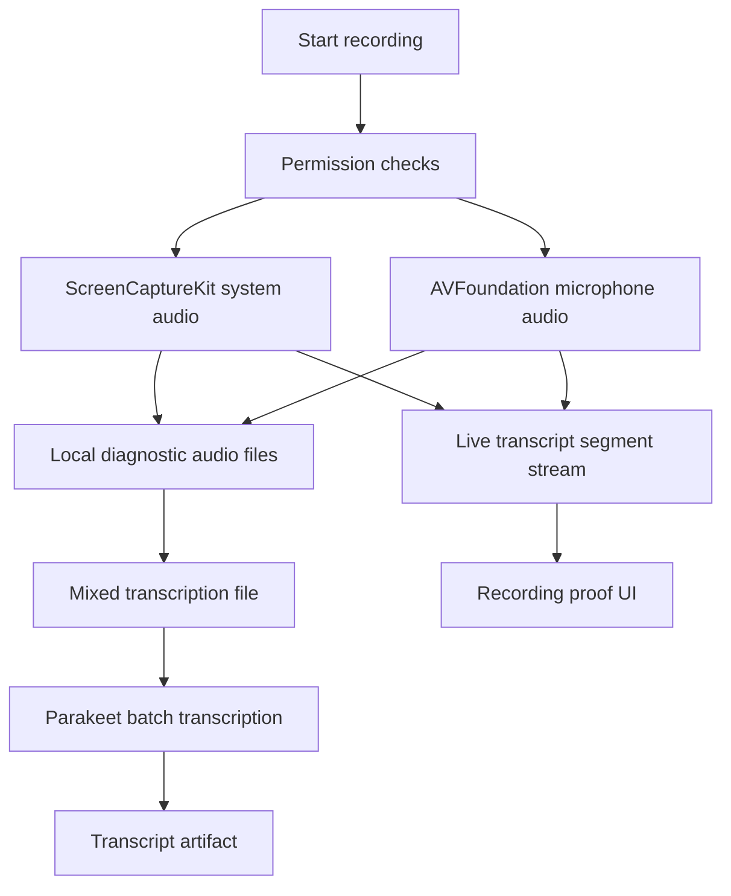

# feat: Phase 2 core capture and transcription

## Summary

This plan turns Phase 2 into three manageable `ce-work` loops: prove Mac audio capture, prove Parakeet transcription, then connect both to a minimal live transcript UI. The phase should stay narrow until a real video meeting can be recorded and transcribed end to end.

---

## Problem Frame

The app only becomes viable if it can capture bot-free meeting audio and turn it into a useful transcript with low latency. Phase 2 is the highest technical risk in the spec because it crosses macOS permissions, ScreenCaptureKit system audio, AVFoundation microphone capture, local file writing, FluidAudio model download, Parakeet transcription, and live UI updates.

Bot-free means the app never joins Zoom, Meet, Teams, or another meeting as a participant. It records only what is already happening locally on the user's Mac: system audio from the meeting client plus microphone audio from the user.

The right next step is not broad product UI. It is a small proof surface inside the macOS app that records local audio artifacts, produces transcripts, and exposes enough diagnostics to decide whether the locked stack is sound.

---

## Requirements

- R1. Capture system audio with ScreenCaptureKit and microphone audio with AVFoundation.
- R2. Start recording within 500 ms after the user clicks Start in normal permission-ready conditions.
- R3. Write clean local audio artifacts that can be manually inspected and reused for transcription.
- R4. Verify capture with a real Zoom call or equivalent video meeting, including remote speaker audio and local mic audio.
- R4a. Verify that no bot, browser automation participant, meeting invitee, or external recorder joins the meeting.
- R5. Add the Core transcription model and provider protocol described in `SPEC.md`.
- R6. Integrate FluidAudio Parakeet as the default Mac transcription provider.
- R7. Transcribe a real 30 minute meeting recording end to end and record speed plus qualitative accuracy notes.
- R8. Show a live transcript UI during recording with partial and final segments.
- R9. Keep Phase 2 local-first. Do not add Convex upload, enhancement, calendar, screenshots, tasks, iOS capture, or Cognee behavior.
- R10. Run automated checks and `ce-code-review` after each manageable work loop.

---

## Scope Boundaries

- No Convex storage upload for audio files.
- No meeting bot or external meeting participant.
- No transcript persistence in Convex.
- No calendar-triggered meeting start flow.
- No LLM enhancement or task extraction.
- No screenshot capture or OCR.
- No iOS transcription work.
- No Deepgram or WhisperKit fallback implementation unless Parakeet is blocked and the deviation is approved.
- No production-grade note editor polish beyond the minimal recording and transcript proof UI.

### Deferred to Follow-Up Work

- Calendar detection and start-notes flow belong to Phase 3.
- Notes, screenshot OCR, hybrid rendering, and enhancement belong to Phase 4.
- Task management belongs to Phase 5.
- iOS companion capture belongs to Phase 7.
- Cognee ingestion and second brain query belong to Phase 9.

---

## Context & Research

### Relevant Code and Patterns

- `SPEC.md` section 9 defines the `TranscriptionProvider` abstraction and Phase 2 provider expectations.
- `SPEC.md` section 19 defines the Phase 2 gates and requires real meeting verification.
- `apps/macOS/project.yml` is the XcodeGen source for the macOS app and should receive framework settings, entitlements, and permissions copy.
- `apps/macOS/MeetingApp/Views/ContentView.swift` is still a placeholder, so the proof UI can be added without disturbing mature product screens.
- `apps/macOS/Tests/MeetingAppTests.swift` currently verifies the scaffold only and can grow into view model tests.
- `packages/Core/Package.swift` is the shared package manifest and should own transcript models plus provider protocols.
- `package.json` already has the full Phase 1 gate in `npm run phase1:check`. Phase 2 should add focused checks without weakening that gate.

### Institutional Learnings

- No `docs/solutions/` entries exist yet. If ScreenCaptureKit, simulator flakiness, or FluidAudio setup produces a repeatable failure pattern, capture it with `ce-compound` after the fix is understood.

### External References

- Apple documents ScreenCaptureKit as the framework for high-performance screen and audio capture on macOS, with `SCStream` emitting media sample buffers. Use Apple docs as the source of truth for stream configuration and permissions: [ScreenCaptureKit](https://developer.apple.com/documentation/screencapturekit).
- Apple sample guidance for macOS screen capture is here: [Capturing screen content in macOS](https://developer.apple.com/documentation/ScreenCaptureKit/capturing-screen-content-in-macos).
- FluidAudio is the planned local Swift audio AI dependency for Parakeet ASR and diarization: [FluidAudio](https://github.com/FluidInference/FluidAudio).
- Latest observed FluidAudio tag during planning is `v0.14.3`. Pin to a stable release during implementation unless API compatibility requires a different tagged version, then log the reason in `DECISIONS.md`.

---

## Key Technical Decisions

- Build capture before transcription. A poor local recording makes every transcription result ambiguous.
- Store Phase 2 recordings locally under Application Support, not Convex. This keeps risk low and protects privacy while the capture stack is still being characterized.
- Record separate diagnostic streams for system and microphone when feasible, plus a mixed mono file for transcription. Separate files make quality failures easier to diagnose.
- Put platform capture engines in the macOS app target. Keep shared transcript value types and provider protocols in Core.
- Implement Parakeet batch transcription before full live transcription. Once batch output is proven, add chunked or streaming behavior behind the same provider abstraction.
- Keep live labels simple during Phase 2: mic is `Me`, system audio is `Them`. Full diarization remains a post-meeting provider responsibility.
- Treat real meeting tests as phase gates, not optional manual QA.

---

## Open Questions

### Resolved During Planning

- The next work should be Phase 2 planning, not another Phase 1 stabilization pass, because the full Phase 1 gate has passed.
- The first Phase 2 implementation loop should target macOS only.
- The proof UI can live in the existing macOS app shell because there is no mature UI to preserve yet.

### Deferred to Implementation

- Exact ScreenCaptureKit microphone behavior on the current macOS install needs execution-time validation. The preferred design still uses AVFoundation for mic because that is locked in `SPEC.md`.
- Exact FluidAudio public API names need implementation-time inspection after adding the package dependency.
- Whether Parakeet can provide true partial streaming in the current FluidAudio release needs a spike. If not, use short chunked transcription for the proof UI and record the deviation.
- Real Zoom test timing depends on when the user can join or create a call with remote audio.

---

## High-Level Technical Design

> This is directional guidance for review, not implementation specification.

---

## Implementation Units

- U1. **Capture session state and permissions**

**Goal:** Add a testable recording session state layer before touching low-level audio plumbing.

**Requirements:** R1, R2, R3

**Dependencies:** Phase 1 approval and green `npm run phase1:check`

**Files:**
- Create: `apps/macOS/MeetingApp/ViewModels/RecordingSessionViewModel.swift`
- Create: `apps/macOS/MeetingApp/Services/CapturePermissionService.swift`
- Create: `apps/macOS/MeetingApp/Models/RecordingSessionState.swift`
- Modify: `apps/macOS/project.yml`
- Test: `apps/macOS/Tests/RecordingSessionViewModelTests.swift`

**Approach:**
- Model idle, checking permissions, ready, recording, stopping, completed, and failed states.
- Add injectable services so tests do not depend on real TCC permissions.
- Surface permission-specific recovery messages for microphone and screen recording.
- Keep the start action asynchronous and observable for UI latency measurement.

**Patterns to follow:**
- Current SwiftUI app scaffold in `apps/macOS/MeetingApp/MeetingApp.swift`.
- Current test target shape in `apps/macOS/Tests/MeetingAppTests.swift`.

**Test scenarios:**
- Happy path: permission-ready start transitions to recording and captures a start timestamp.
- Error path: denied microphone permission transitions to failed with a microphone-specific reason.
- Error path: denied screen recording permission transitions to failed with a screen-recording-specific reason.
- Edge case: stop from idle is a no-op.
- Edge case: double start while recording does not create a second session.

**Verification:**
- `npm run xcode:test:macos`
- `npm run phase1:check`

- U2. **Local audio capture and file writing**

**Goal:** Record system audio and microphone audio into inspectable local files.

**Requirements:** R1, R2, R3, R4

**Dependencies:** U1

**Files:**
- Create: `apps/macOS/MeetingApp/Services/SystemAudioCaptureEngine.swift`
- Create: `apps/macOS/MeetingApp/Services/MicrophoneCaptureEngine.swift`
- Create: `apps/macOS/MeetingApp/Services/MeetingAudioRecorder.swift`
- Create: `apps/macOS/MeetingApp/Services/AudioFileWriter.swift`
- Create: `apps/macOS/MeetingApp/Models/RecordingArtifact.swift`
- Modify: `apps/macOS/project.yml`
- Test: `apps/macOS/Tests/MeetingAudioRecorderTests.swift`
- Test: `apps/macOS/Tests/AudioFileWriterTests.swift`
- Modify: `docs/manual-test-plan.md`

**Approach:**
- Use ScreenCaptureKit for system audio sample buffers.
- Use AVFoundation, likely `AVAudioEngine`, for microphone PCM buffers.
- Normalize sample rate and channel layout into a transcription-ready mixed file.
- Keep system, mic, and mixed outputs when possible to simplify diagnosis.
- Write under `Application Support/MeetingSecondBrain/Recordings/<session-id>/`.
- Record diagnostic metadata such as start time, stop time, duration, sample rate, channel count, and file paths.

**Patterns to follow:**
- Apple ScreenCaptureKit framework boundaries from the official documentation.
- AVFoundation file-writing patterns that keep audio writes off the main actor.

**Test scenarios:**
- Happy path: injected system and mic buffers produce expected recording artifact metadata.
- Error path: system capture fails before mic starts and reports a recoverable setup error.
- Error path: mic capture fails after system capture starts and stops the session cleanly.
- Edge case: stop while buffers are still arriving finalizes files once.
- Edge case: file writer receives no buffers and still closes without crashing.
- Manual gate: real Zoom call capture produces audible remote speaker audio and audible local mic audio.
- Manual gate: recording start latency is measured and documented.

**Verification:**
- `npm run xcode:test:macos`
- `npm run phase1:check`
- `git diff --check`
- Manual real Zoom capture result recorded in `docs/manual-test-plan.md`
- `ce-code-review` before moving to U3

- U3. **Minimal capture proof UI**

**Goal:** Give the user a simple macOS surface to run the real capture gate without terminal-only controls.

**Requirements:** R2, R3, R4

**Dependencies:** U2

**Files:**
- Create: `apps/macOS/MeetingApp/Views/CaptureProofView.swift`
- Modify: `apps/macOS/MeetingApp/Views/ContentView.swift`
- Modify: `apps/macOS/MeetingApp/ViewModels/RecordingSessionViewModel.swift`
- Test: `apps/macOS/Tests/RecordingSessionViewModelTests.swift`

**Approach:**
- Add Start and Stop controls, elapsed time, permission state, current status, and output folder path.
- Show simple system and mic activity indicators from the recorder diagnostics.
- Avoid building a full meeting editor.
- Avoid visible how-to text beyond status and labels needed for operation.

**Test scenarios:**
- UI model: Start becomes disabled while recording.
- UI model: Stop becomes enabled only while recording.
- UI model: completed recording exposes output paths.
- UI model: error state preserves the last actionable failure reason.

**Verification:**
- `npm run xcode:test:macos`
- Manual app launch from Xcode or `xcodebuild test`
- Confirm the proof UI can start and stop a local capture session

- U4. **Core transcript model and provider protocol**

**Goal:** Add the shared transcription contract from the spec before provider implementation.

**Requirements:** R5

**Dependencies:** U2 can run independently, but this unit should land before U5

**Files:**
- Create: `packages/Core/Sources/Core/Models/Transcript.swift`
- Create: `packages/Core/Sources/Core/Services/TranscriptionProvider.swift`
- Modify: `packages/Core/Sources/Core/CoreModule.swift`
- Modify: `packages/Core/Sources/CoreSelfTests/main.swift`
- Test: `packages/Core/Sources/CoreSelfTests/main.swift`

**Approach:**
- Define `Transcript`, `TranscriptSegment`, `TranscriptionConfig`, `TranscriptionProvider`, and `TranscriptionSession`.
- Keep AVFoundation buffer types behind conditional platform imports if needed.
- Make transcript timestamps use milliseconds to align with Convex `transcriptSegments`.
- Include partial versus final segment state for live UI.

**Patterns to follow:**
- `SPEC.md` section 9.
- Existing Core package layout.

**Test scenarios:**
- Model: transcript duration derives from the last segment end time.
- Model: segments sort by start time and preserve speaker labels.
- Config: default English config has diarization enabled.
- Protocol: a fake provider can start a session, accept buffers, return partials, and finish.

**Verification:**
- `npm run swift:test:core`
- `npm run phase1:check`

- U5. **FluidAudio Parakeet batch transcription proof**

**Goal:** Integrate FluidAudio enough to transcribe a local recording file with Parakeet.

**Requirements:** R5, R6, R7

**Dependencies:** U4 and a usable recording artifact from U2

**Files:**
- Modify: `packages/Core/Package.swift`
- Create: `packages/Core/Sources/Core/Services/ParakeetProvider.swift`
- Create: `packages/Core/Sources/Core/Services/ParakeetModelManager.swift`
- Create: `apps/macOS/MeetingApp/Services/TranscriptionRunner.swift`
- Modify: `apps/macOS/project.yml`
- Test: `packages/Core/Sources/CoreSelfTests/main.swift`
- Test: `apps/macOS/Tests/TranscriptionRunnerTests.swift`
- Modify: `docs/manual-test-plan.md`
- Modify: `DECISIONS.md`

**Approach:**
- Add FluidAudio pinned to a tagged release.
- Keep automated tests free of model downloads by testing provider metadata, dependency injection, and fake-runner behavior.
- Add a manual transcription action that runs against the latest mixed audio file.
- Save transcript output as JSON and markdown beside the recording artifact.
- Record model download size, first-run time, transcription elapsed time, and real-time factor.

**Patterns to follow:**
- Core provider protocol from U4.
- Local artifact folder structure from U2.

**Test scenarios:**
- Config: provider reports local, streaming support, diarization support, and Parakeet name accurately.
- Error path: missing model reports a recoverable model setup state.
- Error path: invalid audio file fails without deleting the recording artifact.
- Manual gate: first model download completes or produces an actionable error.
- Manual gate: a real 30 minute recording transcribes end to end.
- Manual gate: transcription duration and qualitative accuracy notes are recorded.

**Verification:**
- `npm run swift:test:core`
- `npm run xcode:test:macos`
- `npm run phase1:check`
- `git diff --check`
- Manual 30 minute transcription result recorded in `docs/manual-test-plan.md`
- `ce-code-review` before moving to U6

- U6. **Live transcript UI**

**Goal:** Show partial and final transcript segments while recording.

**Requirements:** R6, R8

**Dependencies:** U5

**Files:**
- Create: `apps/macOS/MeetingApp/ViewModels/LiveTranscriptViewModel.swift`
- Create: `apps/macOS/MeetingApp/Views/LiveTranscriptView.swift`
- Modify: `apps/macOS/MeetingApp/Views/CaptureProofView.swift`
- Modify: `apps/macOS/MeetingApp/Services/TranscriptionRunner.swift`
- Test: `apps/macOS/Tests/LiveTranscriptViewModelTests.swift`
- Modify: `docs/manual-test-plan.md`

**Approach:**
- Feed short chunks from the capture pipeline into the transcription runner.
- Render partial text quickly, then replace it with final segments when available.
- Label microphone-origin segments as `Me` and system-origin segments as `Them` during the live session.
- Keep transcript updates off the main actor until they are ready to render.
- If true FluidAudio streaming is unavailable, implement a chunked batch adapter and record the deviation.

**Patterns to follow:**
- `SPEC.md` streaming behavior.
- Transcript models from U4.

**Test scenarios:**
- Happy path: partial segment appears and later becomes final.
- Happy path: final segments stay sorted by start timestamp.
- Edge case: repeated partial updates replace the active partial rather than duplicating it.
- Edge case: stop finalizes the active partial or marks it discarded.
- Manual gate: live transcript lag is measured during a real capture.
- Manual gate: UI remains responsive during recording and transcription.

**Verification:**
- `npm run xcode:test:macos`
- `npm run phase1:check`
- Manual live transcript result recorded in `docs/manual-test-plan.md`
- `ce-code-review` before Phase 2 approval

---

## Review and Work Loops

Use this cadence for Phase 2:

1. `ce-work` U1 through U3 as Sprint 1: Mac audio capture proof.
2. Run automated checks, perform the real Zoom capture gate, then run `ce-code-review`.
3. Fix all P1 to P3 review findings before continuing.
4. `ce-work` U4 and U5 as Sprint 2: Parakeet transcription proof.
5. Run automated checks, perform the real 30 minute transcription gate, then run `ce-code-review`.
6. Fix all P1 to P3 review findings before continuing.
7. `ce-work` U6 as Sprint 3: live transcript UI.
8. Run automated checks, perform the live transcript manual gate, then run `ce-code-review`.
9. Ask for user approval before Phase 3 planning or work.

---

## Verification Matrix

| Gate | Command or action | Required result |
|---|---|---|
| Core models | `npm run swift:test:core` | Core self tests pass |
| macOS tests | `npm run xcode:test:macos` | macOS app and unit tests pass |
| Full existing gate | `npm run phase1:check` | Convex, Core, macOS, and iOS checks pass |
| Diff hygiene | `git diff --check` | No whitespace errors |
| Capture manual gate | Real Zoom or equivalent call | System audio and mic audio are clean in output files |
| Transcription manual gate | Real 30 minute recording | Parakeet transcript completes with measured speed and acceptable qualitative accuracy |
| Live UI manual gate | Real or controlled meeting audio | Partial transcript appears with measured lag under the Phase 2 target where feasible |

---

## Risks and Mitigations

| Risk | Mitigation |
|---|---|
| Screen recording or microphone TCC blocks automated tests | Keep permission service injectable and verify real permissions manually |
| System audio and mic clocks drift | Preserve separate files and add mixed-file diagnostics so drift can be measured |
| ScreenCaptureKit API differs by macOS version | Follow Apple docs, keep capture code isolated, and record any OS-specific decision |
| FluidAudio API differs from the spec assumption | Pin a tagged release, inspect examples during implementation, and log any wrapper deviation |
| Parakeet model download is slow or fails | Make model setup visible in UI and keep automated tests offline-safe |
| Live streaming is not supported by the selected FluidAudio release | Use chunked transcription as a Phase 2 fallback only with `DECISIONS.md` entry |
| Phase 2 expands into product UI | Keep UI limited to proof controls, diagnostics, and transcript rendering |

---

## Definition of Done

- Mac app can record a local meeting audio artifact using system audio plus microphone input.
- A real video meeting capture is manually verified and documented.
- Core contains transcript models and the provider protocol from the spec.
- FluidAudio Parakeet can transcribe a real 30 minute recording, or a documented blocker is escalated before changing providers.
- Mac app shows live transcript updates during recording.
- `npm run phase1:check`, `npm run xcode:test:macos`, and `git diff --check` pass.
- `docs/manual-test-plan.md` records the real capture and transcription evidence.
- `DECISIONS.md` records any deviation from `SPEC.md`.
- `ce-code-review` has no unresolved P1 to P3 findings.
- User approves Phase 2 before Phase 3 starts.

---

## Next `ce-work` Target

Start with U1 through U3 only. That is the smallest useful sprint because it proves the recording loop without mixing in Parakeet model setup. The first code pass should stop after the proof UI can run a local capture and the manual Zoom gate is ready.
